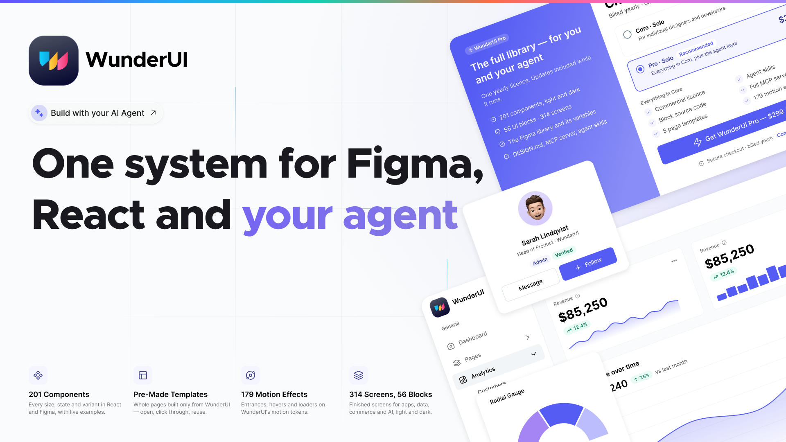
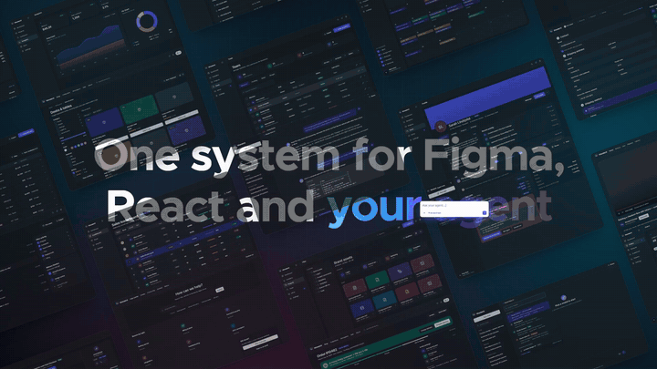

<p align="center">
  <a href="https://wunderui.com"></a>
</p>

<p align="center">
  <a href="https://wunderui.com">Website</a> ·
  <a href="https://wunderui.com/components">Components</a> ·
  <a href="https://wunderui.com/figma">Figma</a> ·
  <a href="https://wunderui.com/#pricing">Pricing</a>
</p>

<p align="center">
  
  
  
  
  
</p>

<p align="center">
  <a href="https://wunderui.com"></a>
</p>

# WunderUI Free

**76 of the 201 WunderUI React components, free as source you own.** Built on Base UI and Tailwind CSS v4, styled by the same tokens as the WunderUI Figma library, light and dark, accessible (WCAG AA contrast on every token pair), and documented with live examples on [wunderui.com](https://wunderui.com).

Copy the files into your project and they are yours: no package to update, no lock-in, MIT licence.

## Quick start

Requirements: React 19, Tailwind CSS v4, and the `@/*` path alias pointing at your source root (the default in Next.js projects).

**The quick way:** add components with the CLI — it writes the files, installs the dependencies and adds the styles:

```bash
npx wunderui-cli add button badge input
```

Then import the styles once (step 3) and use the components (step 4). `npx wunderui-cli list --components` shows all 76.

**By hand:**

**1. Get the source** and copy `components/`, `lib/` and `styles/wunderui.css` into your source root (where `@/` points):

```bash
npx degit wunder-ui/wunderui wunderui-free
```

Files with the same name as components already in your project (`button.tsx`, `badge.tsx` …) are replaced — commit before you copy.

**2. Install the dependencies:**

```bash
npm install @base-ui/react @tiptap/extension-placeholder @tiptap/react @tiptap/starter-kit class-variance-authority cn lucide-react
```

**3. Add the styles** to your Tailwind entry file, after Tailwind:

```css
@import "tailwindcss";
@import "./styles/wunderui.css";
@source "./components";
```

**4. Use a component:**

```tsx
import { Button } from "@/components/ui/button"
import { Badge } from "@/components/ui/badge"

export default function Page() {
  return (
    <div className="flex items-center gap-3">
      <Button variant="primary">Save changes</Button>
      <Badge color="green">Active</Badge>
    </div>
  )
}
```

Every component has a page with examples, props and the matching Figma component on [wunderui.com/components](https://wunderui.com/components).

## Components

### Core Elements (41)

| Component | What it does | Import |
| --- | --- | --- |
| [Accordion](https://wunderui.com/components/accordion) | A vertically stacked set of collapsible panels, in card or divider style. | `Accordion` |
| [Action Bar](https://wunderui.com/components/action-bar) | A floating bar of bulk actions for a selection. | `ActionBar` |
| [Agenda](https://wunderui.com/components/agenda) | A time-ordered list of scheduled events. | `Agenda` |
| [Alert Dialog](https://wunderui.com/components/alert-dialog) | A dialog for confirmations and destructive actions: a click outside does not close it, only a button or Escape does. | `AlertDialog` |
| [Avatar](https://wunderui.com/components/avatar) | A user or entity's profile image with a text fallback. | `Avatar` |
| [Avatar Group](https://wunderui.com/components/avatar-group) | A stack of overlapping avatars, with an optional overflow count. | `AvatarGroup` |
| [Badge](https://wunderui.com/components/badge) | A small status or category label in 12 colors and 6 styles. | `Badge` |
| [Breadcrumb](https://wunderui.com/components/breadcrumb) | Shows the user's location in a hierarchy, in "plain" or bordered "border" style. | `Breadcrumb` |
| [Button](https://wunderui.com/components/button) | The main action trigger, in 10 variants, 2 shapes and 5 sizes. | `Button` |
| [Button Group](https://wunderui.com/components/button-group) | A row of connected buttons sharing borders and outer corners, for view switchers or segmented actions. | `ButtonGroup` |
| [Card](https://wunderui.com/components/card) | A bordered container for grouping related content. | `Card` |
| [Carousel](https://wunderui.com/components/carousel) | A horizontally scrollable row of items with arrow controls. | `Carousel` |
| [Checkbox](https://wunderui.com/components/checkbox) | A single choice that is on or off, with an indeterminate state for “some selected”. | `Checkbox` |
| [Collapsible](https://wunderui.com/components/collapsible) | A single collapsible panel controlled by a trigger button. | `Collapsible` |
| [Dialog](https://wunderui.com/components/dialog) | A modal window for focused tasks, built on Base UI. | `Dialog` |
| [Divider with Label](https://wunderui.com/components/divider-with-label) | A separator with a centered text label, e.g. for "or" between two sign-in options. | `DividerWithLabel` |
| [Empty State](https://wunderui.com/components/empty-state) | Placeholder shown when a list or search has no results. | `EmptyState` |
| [File Tree](https://wunderui.com/components/file-tree) | A collapsible, indented tree of folders and files. | `FileTree` |
| [Floating TOC](https://wunderui.com/components/floating-toc) | A sticky table of contents with an active-section indicator. | `FloatingToc` |
| [Holo Card](https://wunderui.com/components/holo-card) | A card with a mouse-tracking spotlight/gradient shine effect. | `HoloCard` |
| [Hover Card](https://wunderui.com/components/hover-card) | A rich preview popup shown on hovering a trigger. | `HoverCard` |
| [Icon Button](https://wunderui.com/components/icon-button) | A square or circular button for a single icon action. | `IconButton` |
| [Input](https://wunderui.com/components/input) | A single-line text field with sm/default/lg sizes and error state. | `Input` |
| [Item Card](https://wunderui.com/components/item-card) | A generic row card: icon, title, description, meta, action. | `ItemCard` |
| [Kbd](https://wunderui.com/components/kbd) | Displays a keyboard key or shortcut, e.g. inside a search input. | `Kbd` |
| [Meter](https://wunderui.com/components/meter) | A graphical display of a fixed value within a range, e.g. disk usage. | `Meter` |
| [Pagination](https://wunderui.com/components/pagination) | Page navigation with Prev/Next and numbered pages, or a simple "Page X of Y" mode. | `Pagination` |
| [Progress](https://wunderui.com/components/progress) | A horizontal bar showing completion of a task. | `Progress` |
| [Radio Group](https://wunderui.com/components/radio-group) | A set of mutually exclusive options. | `RadioGroup` |
| [Separator](https://wunderui.com/components/separator) | A thin dividing line, horizontal or vertical, solid or dashed. | `Separator` |
| [Skeleton](https://wunderui.com/components/skeleton) | A pulsing placeholder shown while content is loading. | `Skeleton` |
| [Slider](https://wunderui.com/components/slider) | A draggable control for selecting one value or a range along a track. | `Slider` |
| [Spinner](https://wunderui.com/components/spinner) | A spinning indicator for an in-progress loading state. | `Spinner` |
| [Switch](https://wunderui.com/components/switch) | A toggle control for a binary setting. | `Switch` |
| [Tabs](https://wunderui.com/components/tabs) | Switches between related views in the same context. | `Tabs` |
| [Textarea](https://wunderui.com/components/textarea) | A multi-line text field with sm/default/lg sizes and an optional character counter. | `Textarea` |
| [Timeline](https://wunderui.com/components/timeline) | A vertical sequence of dated, dot-connected events. | `Timeline` |
| [Toggle](https://wunderui.com/components/toggle) | A standalone two-state button that can be pressed or unpressed. | `Toggle` |
| [Toolbar](https://wunderui.com/components/toolbar) | A container for grouping a set of buttons and controls. | `Toolbar` |
| [Tooltip](https://wunderui.com/components/tooltip) | A short label shown on hover, in any of 4 directions. | `Tooltip` |
| [Widget](https://wunderui.com/components/widget) | A generic dashboard widget shell: header, body, footer. | `Widget` |

### Feedback & Overlays (11)

| Component | What it does | Import |
| --- | --- | --- |
| [Alert](https://wunderui.com/components/alert) | An inline banner in 5 colors and 2 sizes, with an optional close button and action. | `Alert` |
| [Emoji Picker](https://wunderui.com/components/emoji-picker) | A grid of selectable emoji, typically shown inside a Popover. | `EmojiPicker` |
| [Emoji Reaction Button](https://wunderui.com/components/emoji-reaction-button) | A toggleable emoji reaction with a count, like a Slack reaction. | `EmojiReactionButton` |
| [Number Value](https://wunderui.com/components/number-value) | A large number with its change beside it: caret up or down, green or red. | `NumberValue` |
| [Popover](https://wunderui.com/components/popover) | A floating panel anchored to a trigger element. | `Popover` |
| [Pressable Feedback](https://wunderui.com/components/pressable-feedback) | Wraps any content with a scale-down press animation. | `PressableFeedback` |
| [Pull to Refresh](https://wunderui.com/components/pull-to-refresh) | Drag down from the top of any content past a threshold to trigger an async refresh, with a rotating spinner and a rubber-band release. | `PullToRefresh` |
| [Rating](https://wunderui.com/components/rating) | An interactive star rating input. | `Rating` |
| [Sheet](https://wunderui.com/components/sheet) | A panel that slides in from an edge of the screen — left, right, or bottom. | `Sheet` |
| [Toast](https://wunderui.com/components/toast) | A temporary notification that appears in the corner of the screen, with success/error/warning/info types. | `ToastProvider` |
| [Trend Chip](https://wunderui.com/components/trend-chip) | A small pill showing a change, up or down, in seven icon styles. | `TrendChip` |

### Forms (24)

| Component | What it does | Import |
| --- | --- | --- |
| [Autocomplete](https://wunderui.com/components/autocomplete) | An input that suggests options as you type. | `Autocomplete` |
| [Calendar](https://wunderui.com/components/calendar) | A month-grid date picker with single or range selection. | `Calendar` |
| [Cell Color Picker](https://wunderui.com/components/cell-color-picker) | A compact color swatch picker for inline use in a Data Grid cell. | `CellColorPicker` |
| [Cell Select](https://wunderui.com/components/cell-select) | A compact select for inline use in a Data Grid cell. | `CellSelect` |
| [Cell Slider](https://wunderui.com/components/cell-slider) | A compact progress/value slider for inline use in a Data Grid cell. | `CellSlider` |
| [Cell Switch](https://wunderui.com/components/cell-switch) | A compact switch for inline use in a Data Grid cell. | `CellSwitch` |
| [Checkbox Button Group](https://wunderui.com/components/checkbox-button-group) | A multi-select group of toggle-styled buttons. | `CheckboxButtonGroup` |
| [Color Picker](https://wunderui.com/components/color-picker) | Pick a colour: saturation and brightness, hue, opacity, eyedropper, HEX/RGB/HSL values and saved colours — inline or from a trigger field. | `ColorPicker` |
| [Combobox](https://wunderui.com/components/combobox) | An input combined with a filterable list of predefined items to select. | `Combobox` |
| [Date Picker](https://wunderui.com/components/date-picker) | A Calendar inside a Popover, with Cancel/Apply actions. | `DatePicker` |
| [Drop Zone](https://wunderui.com/components/drop-zone) | A drag-and-drop file upload target with a click-to-browse fallback. | `DropZone` |
| [Field](https://wunderui.com/components/field) | Labelling and validation for a single form control — label, description, and error message. | `Field` |
| [Fieldset](https://wunderui.com/components/fieldset) | A native fieldset with a legend, for grouping related fields. | `Fieldset` |
| [Form](https://wunderui.com/components/form) | A form wrapper that simplifies validation and submission. | `Form` |
| [Inline Select](https://wunderui.com/components/inline-select) | A compact select meant to sit inline within a sentence of text. | `InlineSelect` |
| [Input Group](https://wunderui.com/components/input-group) | Groups an input with leading/trailing addons — icons, buttons, or text. | `InputGroup` |
| [Label](https://wunderui.com/components/label) | An accessible label for a form control. | `Label` |
| [Native Select](https://wunderui.com/components/native-select) | A full-width styled select trigger and popup list. | `NativeSelect` |
| [Number Field](https://wunderui.com/components/number-field) | A numeric input with increment/decrement buttons. | `NumberField` |
| [Number Stepper](https://wunderui.com/components/number-stepper) | A +/- increment control for a bounded numeric value. | `NumberStepper` |
| [OTP Field](https://wunderui.com/components/otp-field) | A segmented input for one-time passwords and verification codes. | `OtpField` |
| [Radio Button Group](https://wunderui.com/components/radio-button-group) | A single-select group of toggle-styled buttons. | `RadioButtonGroup` |
| [Rich Text Editor](https://wunderui.com/components/rich-text-editor) | A Tiptap-powered WYSIWYG editor with a formatting toolbar. | `RichTextEditor` |
| [Selector Item](https://wunderui.com/components/selector-item) | A list row pairing a leading icon/avatar and label/description with a trailing radio, checkbox, or switch. | `SelectorItem` |

## Build with AI

Give your coding agent the whole design system: tokens, prop signatures and examples for every component.

```bash
claude mcp add wunderui -- npx -y wunderui-mcp
```

Works with Claude Code, Cursor, Windsurf, Cline and Codex ([wunderui-mcp](https://github.com/Kl-webmedia/wunderui-mcp)). The repository also includes [`AGENTS.md`](AGENTS.md) with the rules agents should follow.

## WunderUI Core and Pro

The free components are the foundation. [WunderUI Core and Pro](https://wunderui.com/#pricing) add the rest of the system: 119 more components, ready-made screens and templates, the full Figma library and agent skills.

| Group | Components | Includes |
| --- | --- | --- |
| AI & Agents | 45 | Activity Item, Agent Avatar, Agent Grid, Agent Lane, Agent Plan, Agent Status, … |
| Block Parts | 44 | Auth Heading, Backup Code, Checklist Task, Checkout Steps, Column Header, Command Item Row, … |
| Core Elements | 4 | Dropdown Menu, Kanban, List View, Table |
| Data & Charts | 14 | Area Chart, Bar Chart, Bubble Chart, Candlestick Chart, Column Chart, Composed Chart, … |
| KPI / Metric Card | 3 | KPI, KPI Group, Metric Card |
| Navigation & Layout | 9 | App Layout, Command, Context Menu, Navbar, Resizable, Scroll Area, … |

[See plans and pricing →](https://wunderui.com/#pricing)

## Licence

The code in this repository is MIT licensed. WunderUI Core and Pro components, blocks, templates and the Figma library are covered by the [WunderUI licence](https://wunderui.com/legal/license).

This repository is generated from the WunderUI source with every release, so it does not take pull requests; please report bugs and ideas in [Issues](https://github.com/wunder-ui/wunderui/issues).
